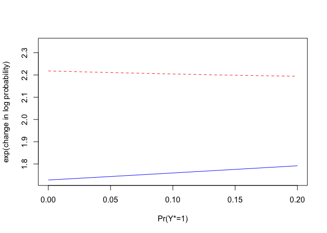

<!-- README.md is generated from README.Rmd. Please edit that file -->

# ciccr

<!-- badges: start -->

[](https://travis-ci.org/github/sokbae/ciccr)
<!-- badges: end -->

The goal of ciccr is to implement methods for carrying out causal
inference in case-control studies ([Jun and
Lee, 2020](https://arxiv.org/abs/2004.08318)).

## Installation

You can install the released version of ciccr from
[CRAN](https://CRAN.R-project.org) with:

``` r
install.packages("ciccr")
```

Alternatively, you can install the development version from
[GitHub](https://github.com/)
with:

``` r
# install.packages("devtools") # uncomment this line if devtools is not installed yet 
devtools::install_github("sokbae/ciccr")
```

## Example

We first call the ciccr package.

``` r
library(ciccr)
```

To illustrate the usefulness of the package, we use the dataset ACS that
is included in the package. This dataset is an extract from American
Community Survey (ACS) 2018, restricted to white males residing in
California with at least a bachelor’s degree. The ACS is an ongoing
annual survey by the US Census Bureau that provides key information
about US population. We use the following variables:

``` r
  y = ACS$topincome
  t = ACS$baplus
  x = ACS$age
```

  - The binary outcome `y` is defined to be one if a respondent’s annual
    total pre-tax wage and salary income is top-coded. In the sample
    extract, the top-coded income bracket has median income $565,000 and
    the next highest income that is not top-coded is $327,000.

  - The binary treatment `t` is defined to be one if a respondent has a
    master’s degree, a professional degree, or a doctoral degree.

  - The covariate `x` is age in years and is restricted to be between 25
    and 70.

The original ACS survey is not from case-control sampling but we
construct a case-control sample by the following procedure:

1.  The case sample is composed of 921 individuals whose income is
    top-coded.
2.  The control sample of equal size is randomly drawn without
    replacement from the pool of individuals whose income is not
    top-coded.

We now construct cubic b-spline terms with three inner knots using the
age variable.

``` r
  x = splines::bs(x, df = 6)
```

Using the retrospective sieve logistic regression model, we estimate the
average of the log odds ratio conditional on the case sample by

``` r
  results_case = avg_retro_logit(y, t, x, 'case')
  results_case$est
#>         y 
#> 0.7286012
  results_case$se
#>         y 
#> 0.1013445
```

Here, option `'case'` refers to conditioning on the event that income is
top-coded.

Similarly, we estimate the average of the log odds ratio conditional on
the control sample by

``` r
  results_control = avg_retro_logit(y, t, x, 'control')
  results_control$est
#>         y 
#> 0.5469094
  results_control$se
#>         y 
#> 0.1518441
```

Here, option `'control'` refers to conditioning on the event that income
is not top-coded.

We carry out causal inference by

``` r
  results = cicc(y, t, x, p_upper = 0.2)
```

Here, 0.2 is the specified upper bound for unknown case probability. If
it is not specified, the default choice for `p` is `p = 1`.

``` r
  est = results$est
  print(est)
#>  [1] 0.5469094 0.5488219 0.5507345 0.5526470 0.5545596 0.5564721 0.5583847
#>  [8] 0.5602972 0.5622097 0.5641223 0.5660348 0.5679474 0.5698599 0.5717725
#> [15] 0.5736850 0.5755976 0.5775101 0.5794227 0.5813352 0.5832477
  se = results$se
  print(se)
#>  [1] 0.1518441 0.1502495 0.1486627 0.1470838 0.1455132 0.1439511 0.1423978
#>  [8] 0.1408536 0.1393188 0.1377937 0.1362787 0.1347740 0.1332800 0.1317971
#> [15] 0.1303256 0.1288660 0.1274187 0.1259841 0.1245626 0.1231546
  ci = results$ci
  print(ci)
#>  [1] 0.7966706 0.7959604 0.7952628 0.7945784 0.7939075 0.7932506 0.7926083
#>  [8] 0.7919808 0.7913688 0.7907728 0.7901933 0.7896308 0.7890860 0.7885594
#> [15] 0.7880516 0.7875633 0.7870953 0.7866480 0.7862224 0.7858191
  pseq = results$pseq
  print(pseq)
#>  [1] 0.00000000 0.01052632 0.02105263 0.03157895 0.04210526 0.05263158
#>  [7] 0.06315789 0.07368421 0.08421053 0.09473684 0.10526316 0.11578947
#> [13] 0.12631579 0.13684211 0.14736842 0.15789474 0.16842105 0.17894737
#> [19] 0.18947368 0.20000000
```

The S3 object `results` contains a grid of estimates `est`, standard
errors `se`, and one-sided confidence intervals `ci` ranging from `p
= 0` to `p = p_upper`. In addition, the grid `pseq` from 0 to `p_upper`
is saved as part of the S3 object `results`.

The default coverage probability is set at 0.95 and the default length
of the grid is 20. Both can can be changed in the `cicc` command. For
example, the following command sets the coverage probability at 0.9 and
the length of the grid at 30.

``` r
  results = cicc(y, t, x, p_upper = 0.2, cov_prob = 0.9, length = 30L)
```

The point estimates and confidence interval estimates of the `cicc`
command are based on the scale of log relative risk. It is more
conventional to look at the results in terms of the relative scale. To
do so, we take the exponential:

``` r
  e_est = exp(est)
  e_ci = exp(ci)
  print(e_est)
#>  [1] 1.727904 1.731212 1.734527 1.737847 1.741174 1.744507 1.747847 1.751193
#>  [9] 1.754545 1.757904 1.761269 1.764641 1.768019 1.771404 1.774795 1.778193
#> [17] 1.781597 1.785008 1.788425 1.791848
  print(e_ci)
#>  [1] 2.218144 2.216569 2.215023 2.213507 2.212023 2.210571 2.209151 2.207765
#>  [9] 2.206415 2.205100 2.203822 2.202583 2.201383 2.200224 2.199108 2.198034
#> [17] 2.197005 2.196023 2.195089 2.194203
```

It is handy to examine the results by plotting a graph.

``` r
  yaxis_limit = c(min(e_est),(max(e_ci)+0.25*(max(e_ci)-min(e_est))))
  plot(pseq, e_est, type = "l", lty = "solid", col = "blue", xlab = "Pr(Y*=1)",ylab = "exp(change in log probability)", xlim = c(0,max(pseq)), ylim = yaxis_limit)
  lines(pseq, e_ci, type = "l", lty = "dashed", col = "red")
```



To interpret the results, we assume both marginal treatment response
(MTR) and marginal treatment selection (MTS). In this setting, MTR means
that everyone will not earn less by obtaining a degree higher than
bachelor’s degree; MTS indicates that those who selected into higher
education have higher potential to earn top incomes. Based on the MTR
and MTS assumptions, we can conclude that the treatment effect lies in
between 1 and the upper end point of the one-sided confidence interval
with high probability. Thus, the estimates in the graph above suggest
that the effect of obtaining a degree higher than bachelor’s degree is
anywhere between \[1, 2.2\], which roughly implies that the chance of
earning top incomes may increase up to by a factor of around 2, but
allowing for possibility of no positive effect at all. In other words,
it is unlikely that the probability of earning top incomes will more
than double by pursuing higher education beyond BA. See [Jun and
Lee, 2020](https://arxiv.org/abs/2004.08318) for more detailed
explanations regarding how to interpret the estimation results.

# Comparison with Logistic Regression

We can compare these results with estimates obtained from logistic
regression.

``` r
logit = stats::glm(y~t+x, family=stats::binomial("logit"))
est_logit = stats::coef(logit)
ci_logit = stats::confint(logit, level = 0.9)
#> Waiting for profiling to be done...
# point estimate
exp(est_logit)
#> (Intercept)           t          x1          x2          x3          x4 
#>  0.05461156  2.06117153  4.42179639 12.99601849 19.03962976 26.83565737 
#>          x5          x6 
#>  6.42381406 26.14359394
# confidence interval
exp(ci_logit)
#>                     5 %       95 %
#> (Intercept)  0.01960819  0.1304108
#> t            1.75166056  2.4271287
#> x1           1.05679997 21.6604223
#> x2           5.50583091 33.8909622
#> x3           6.79458010 61.3258710
#> x4          10.22943808 78.7353953
#> x5           2.00536450 22.8509008
#> x6           8.66983039 87.6311482
```

Here, the relevant coefficient is 2.06 (`t`) and its two-sided 90%
confidence interval is \[1.75, 2.43\]. If we assume strong ignorability,
the treatment effect is about 2 and its two-sided confidence interval is
between \[1.75, 2.43\]. However, it is unlikely that the higher BA
treatment satisfies the strong ignorability condition.

## Reference

Sung Jae Jun and Sokbae Lee. Causal Inference in Case-Control Studies.
<https://arxiv.org/abs/2004.08318>.
